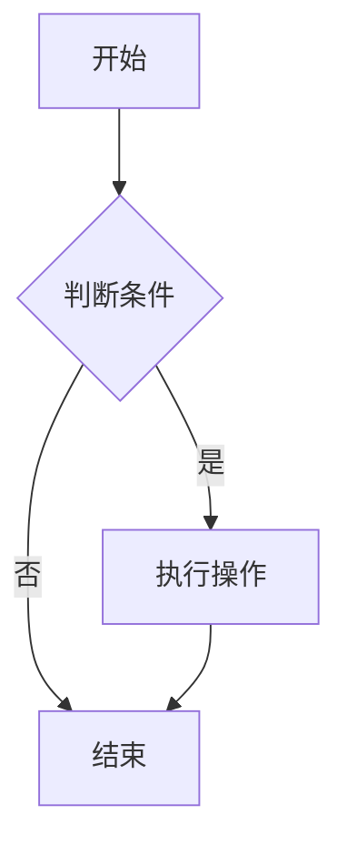

# kk-blog

> 🚀 基于 Next.js 15 + React 19 + TypeScript 的现代化个人博客系统，支持 MDX、主题切换、全自动静态生成与高性能渲染。

---

## ✨ 特性亮点

- **Next.js 15 App Router**：充分利用服务端组件（RSC）与客户端组件分离，极致性能与最佳开发体验。
- **MDX 博客系统**：支持 Markdown/MDX 文章，自动解析 frontmatter，内容即代码。
- **Mermaid 图表支持**：自动生成 SVG 图表，支持流程图、时序图、类图等多种图表类型。
- **主题切换**：内置亮/暗色主题，支持平滑动画切换。
- **响应式设计**：移动端与桌面端自适应，极致体验。
- **极致性能**：首屏 SSR/SSG，客户端包体极小，SEO 友好。
- **组件分层**：服务端组件/客户端组件严格分离，导入导出结构清晰，易维护、易扩展。
- **TypeScript 全量类型安全**。

---

## 🗂️ 目录结构

```
src/
├── components/          # 通用组件
│   ├── ui/             # 基础 UI 组件
│   ├── icons/          # 图标组件
│   └── index.ts        # 统一导出文件
├── features/           # 功能模块组件
│   ├── blog/           # 博客相关组件
│   │   ├── index.ts         # 客户端组件导出
│   │   ├── server.ts        # 服务器组件导出（如 BlogCards、RecentPostsData）
│   │   └── ...
│   ├── layout/         # 布局相关组件
│   ├── search/         # 搜索相关组件
│   ├── home/           # 首页相关组件
│   └── index.ts        # 统一导出文件
├── app/                # Next.js App Router 页面
├── utils/              # 工具函数
├── lib/                # 第三方库配置
├── types/              # TypeScript 类型定义
├── contexts/           # React Context
├── config/             # 配置文件
├── style/              # 全局样式（Tailwind、全局CSS）
├── scripts/            # 构建脚本
│   ├── generate-diagrams.mjs    # Mermaid 图表生成脚本
│   ├── replace-mermaid.mjs      # Mermaid 代码块替换脚本
│   └── generate-search-index.mjs # 搜索索引生成脚本
└── ...
```

---

## 🧩 组件组织与最佳实践

- **通用组件**（`src/components/`）：UI、icons、主题等，全部为可复用的纯展示组件。
- **功能模块组件**（`src/features/`）：按业务领域分组（如 blog、layout、search、home），每个模块有自己的 `index.ts`（客户端组件导出）和 `server.ts`（服务端组件导出）。
- **服务端组件**（Server Components）：如 `BlogCards`、`RecentPostsData`，只在 `server.ts` 导出，负责数据获取、文件读取等。
- **客户端组件**（Client Components）：如 `ThemeToggle`、`SearchModal`、`ActionButtons`，只在 `index.ts` 导出，负责交互和 UI。
- **导入规范**：页面/组件只从对应的 `index.ts` 或 `server.ts` 导入，避免混用。
- **命名规范**：组件文件用 PascalCase，目录用 kebab-case，工具文件用 camelCase。

更多详细规范见 [`COMPONENT_ORGANIZATION.md`](./COMPONENT_ORGANIZATION.md)。

---

## ⚙️ 技术栈

- **Next.js 15**（App Router, RSC, SSG/SSR/ISR）
- **React 19**
- **TypeScript 5**
- **Tailwind CSS 4**
- **MDX/Markdown**（`@next/mdx`, `gray-matter`）
- **Mermaid**（`@mermaid-js/mermaid-cli`）- 图表生成
- **Puppeteer** - 浏览器引擎
- **dayjs**（日期处理）
- **Framer Motion**（动画）
- **ESLint + Prettier**（代码规范）

---

## 📝 主要功能

1. **MDX 博客系统**
   - 文章存储在根目录的 `posts/` 文件夹下，支持 `.md` 和 `.mdx`。
   - `getBlogPosts.ts` 工具函数负责读取和解析这些文件。
   - `[slug]/page.tsx` 动态页面负责将 MDX 内容渲染为 HTML。

2. **Mermaid 图表支持**
   - 支持在 MDX 文件中使用 Mermaid 代码块绘制各种图表。
   - 自动生成 SVG 文件，完全 SSR 兼容，无客户端水合问题。
   - 支持流程图、时序图、类图、状态图、实体关系图、饼图、甘特图等。
   - 增量构建：只处理有变化的文件，提升开发效率。

3. **主题切换**
   - `ThemeContext.tsx` 提供了切换亮色和暗色主题的功能。
   - 通过 `<html>` 标签的 `data-theme` 属性实现主题切换。
   - `ThemeToggle.tsx` 组件提供了切换 UI，并使用了 `startViewTransition` API 实现平滑动画。

4. **响应式布局**
   - 页面布局包含侧边栏 (`Sidebar`) 和主内容区，适配桌面与移动端。
   - 使用 Tailwind CSS 进行样式和布局控制。

5. **高性能渲染**
   - 服务端组件负责数据获取，客户端组件只负责交互。
   - 首屏 SSR/SSG，SEO 友好，极致性能。

---

## 🚀 快速开始

### 1. 安装依赖

```bash
yarn install
# 或
npm install
```

### 2. 本地开发

```bash
yarn dev
# 或
npm run dev
```

### 3. 生产构建

```bash
yarn build
yarn start
# 或
npm run build
npm start
```

---

## 📊 Mermaid 图表使用指南

### 在 MDX 文件中使用 Mermaid

在 MDX 文件中，你可以直接使用 Mermaid 代码块来创建图表：

````markdown

````

### 支持的图表类型

- **流程图** (`graph`, `flowchart`)
- **时序图** (`sequenceDiagram`)
- **类图** (`classDiagram`)
- **状态图** (`stateDiagram`)
- **实体关系图** (`erDiagram`)
- **饼图** (`pie`)
- **甘特图** (`gantt`)

### 开发工作流程

#### 1. 开发阶段（推荐）

修改 MDX 文件后，只处理该文件：

```bash
# 生成单个文件的 SVG 图表
yarn generate-diagrams "posts/vue/某个文件.mdx"

# 替换单个文件的 Mermaid 代码块
yarn replace-mermaid "posts/vue/某个文件.mdx"

# 强制重新生成（如果需要）
yarn generate-diagrams "posts/vue/某个文件.mdx" --force
```

#### 2. 生产构建

构建时会自动处理所有文件：

```bash
yarn build
```

构建流程：
1. 扫描所有 MDX 文件中的 Mermaid 代码块
2. 生成对应的 SVG 文件到 `public/diagrams/`
3. 将 Mermaid 代码块替换为 SVG `` 标签
4. 生成搜索索引
5. 执行 Next.js 构建

### 性能优化

- **增量构建**：只处理有变化的文件，开发时构建时间从 20-30 秒降低到 1-2 秒
- **智能跳过**：已存在的 SVG 文件自动跳过，避免重复工作
- **完全静态化**：生成的 SVG 文件完全 SSR 兼容，无客户端 JavaScript 依赖

### 文件命名规则

生成的 SVG 文件命名规则：`[分类]-[文件名]-[序号].svg`

例如：`vue-Vue2 Diff算法原理详解-0.svg`

### 开发工具配置

项目已配置 VSCode 插件推荐：
- **Mermaid Preview**：实时预览 Mermaid 图表
- **Mermaid Markdown Syntax Highlighting**：语法高亮

---

## 📝 文章写作

- 所有文章存放于根目录的 `posts/` 文件夹，支持 `.md` 和 `.mdx`。
- 支持 frontmatter（如 title, date, tags, overview）。
- 支持 Mermaid 图表，使用 ````mermaid` 代码块。
- 新增文章只需添加新文件，无需重启服务。

---

## 🛡️ 最佳实践

- **只在需要交互的地方用 `'use client'`**，其余全部用服务端组件，最大化性能。
- **严格分离服务端/客户端组件**，防止 Node.js 代码被打包到客户端。
- **Tailwind CSS** 统一样式，支持响应式与暗黑模式。
- **类型安全**，所有 props、数据结构均有 TypeScript 类型定义。
- **Mermaid 图表**：开发时使用增量构建，生产时使用完整构建流程。

---

## 🖥️ 部署建议

- 推荐部署到 [Vercel](https://vercel.com/)（官方支持 Next.js），也可用 Netlify、阿里云、腾讯云等。
- 生产环境建议开启静态优化（SSG/ISR），提升访问速度。
- Mermaid 图表会自动生成 SVG 文件，无需额外配置。

---

## 🤝 贡献与反馈

- 欢迎提 Issue、PR 或建议！
- 如需定制开发、技术咨询可联系作者。

---

## 📄 License

MIT
