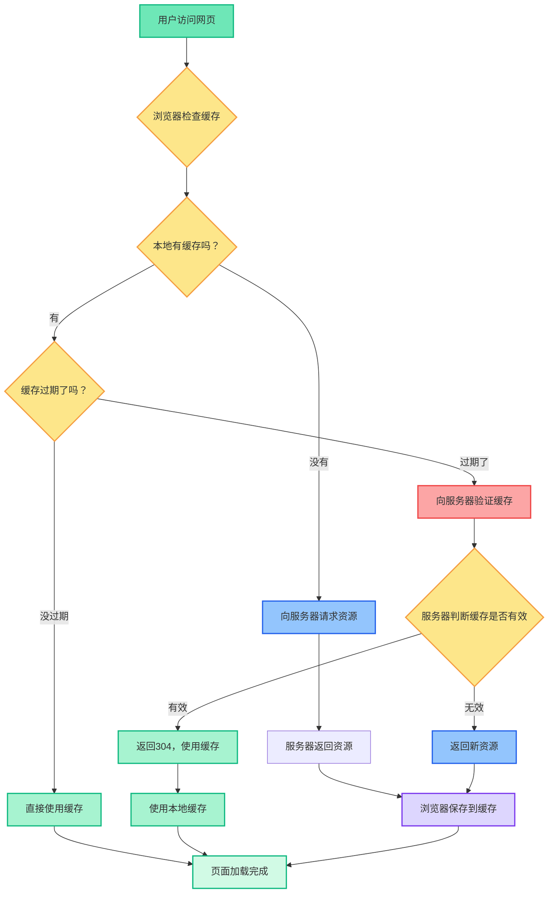
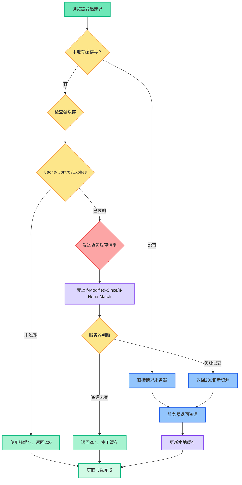
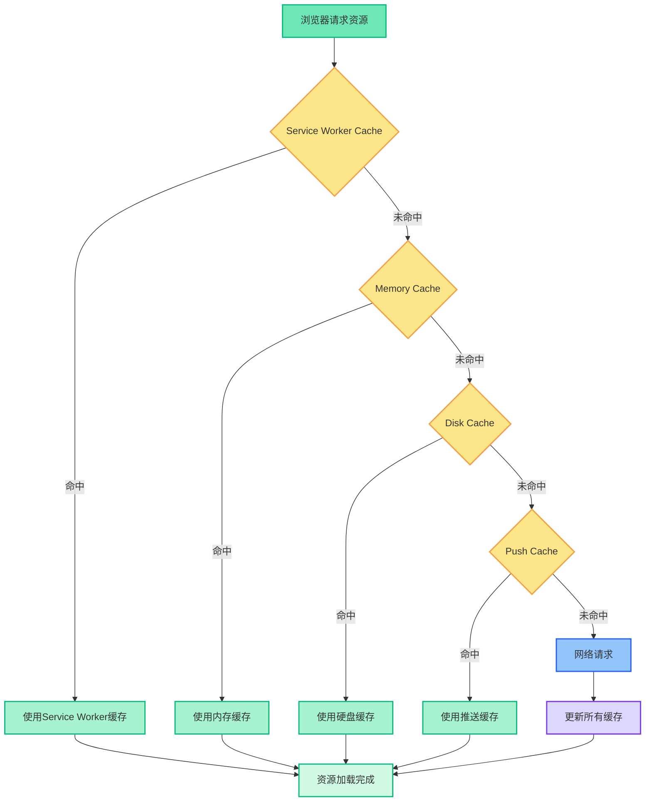

## 什么是浏览器缓存

浏览器缓存是浏览器将请求过的资源（HTML、CSS、JS、图片等）存储在本地，下次请求时直接复用，减少网络请求的机制。

**简单来说：**

- 浏览器把网页上的图片、CSS、JS文件等资源保存到本地
- 下次访问时，如果资源没变，就直接用本地的，不用重新下载
- 这样网页加载速度就快了很多

## 为什么需要缓存

想象一下，你每天都要去同一个超市买东西：

- **没有缓存**：每次都要重新问路、重新找商品位置
- **有缓存**：第一次去记住路线和商品位置，后面直接去拿就行

网页也是一样：

- 第一次访问：下载所有资源（慢）
- 后续访问：直接使用本地缓存（快）

## 浏览器缓存流程图




## 缓存的两种策略

浏览器缓存有两种策略：**强缓存**和**协商缓存**。

### 强缓存（强制缓存）

强缓存就像是给资源设置一个"保质期"，在保质期内，浏览器直接使用本地缓存，连问都不问服务器。

**HTTP头部字段：**

1. `Cache-Control` (HTTP/1.1, 推荐使用，优先级更高)

- `max-age=xxx`: 指定资源缓存的相对时间（单位：秒）。例如 `max-age=3600` 表示缓存1小时。
- `no-cache`: **不是不缓存**，而是强制浏览器每次使用缓存前，都必须向服务器发起请求进行验证（即进入协商缓存流程）。
- `no-store`: **完全不缓存**。浏览器不保留任何资源副本，每次都请求全新资源。
- `public`: 表明响应可以被任何对象（包括浏览器、CDN等代理服务器）缓存。
- `private`: 表明响应只能被单个用户（通常是浏览器）缓存，不允许代理服务器缓存。
  `Expires` (HTTP/1.0, 优先级低)
- 指定一个**绝对的过期时间**，如 `Expires: Wed, 15 Jan 2025 12:00:00 GMT`。
- 缺点是它依赖于客户端本地时间，如果用户本地时间不准确，可能导致缓存提前或延迟失效。

### 协商缓存（对比缓存）

协商缓存就像是"先问问服务器这个资源有没有更新"，如果没更新就用本地缓存，有更新就下载新的。

协商缓存由两对请求头/响应头组合实现：

1. **`ETag` / `If-None-Match` (推荐使用，优先级更高)**
   - **首次响应**: 服务器在响应头中提供 `ETag: "some-unique-hash"`，`ETag` 是基于资源内容生成的唯一标识符。
   - **后续请求**: 浏览器在请求头中携带 `If-None-Match: "some-unique-hash"`。
   - **服务器判断**: 服务器对比浏览器传来的 `ETag` 与当前资源的 `ETag`。若一致，返回 `304`；若不一致，返回 `200` 和新资源及新的 `ETag`。
2. **`Last-Modified` / `If-Modified-Since`**
   - **首次响应**: 服务器在响应头中提供 `Last-Modified: Wed, 15 Jan 2025 11:00:00 GMT`，表示资源的最后修改时间。
   - **后续请求**: 浏览器在请求头中携带 `If-Modified-Since: Wed, 15 Jan 2025 11:00:00 GMT`。
   - **服务器判断**: 服务器比较该时间与资源的最后修改时间。若时间一致，返回 `304`。

为什么 ETag 更优越？

ETag 比 Last-Modified 更精确，因为它解决了以下问题：

- **精度问题**：`Last-Modified` 只能精确到秒，无法感知一秒内的多次修改。
- **时间戳问题**：有时文件内容没有改变，但其修改时间却因为某些操作（如git部署）而更新，会导致不必要的重新下载。
- **分布式服务器问题**：不同服务器上的文件修改时间可能不完全同步。

## 强缓存 vs. 协商缓存（总结对比）

| 特性               | 强缓存                                 | 协商缓存                                     |
| ------------------ | -------------------------------------- | -------------------------------------------- |
| **是否请求服务器** | 否（命中时）                           | 是                                           |
| **HTTP状态码**     | `200` (from memory cache / disk cache) | `304` (Not Modified)                         |
| **关键头部**       | `Cache-Control` / `Expires`            | `ETag` / `Last-Modified`                     |
| **性能开销**       | 无网络请求，性能最佳                   | 有一次HTTP请求（仅头部，无响应体），开销较小 |
| **适用场景**       | 长期不变的静态资源（如带hash的JS/CSS） | 经常可能被更新的资源（如入口HTML文件）       |

## 缓存策略决策树




## 缓存存储在哪里

浏览器缓存有四个存储位置，按优先级排序：

### 1. Service Worker Cache

- 最优先级的缓存
- 可以完全控制缓存策略
- 离线也能访问

### 2. Memory Cache（内存缓存）

- 存储在内存中，读取速度快
- 浏览器关闭后清空
- 适合JS、字体、图片等

### 3. Disk Cache（硬盘缓存）

- 存储在硬盘中，容量大
- 浏览器关闭后仍然保留
- 适合CSS等静态资源

### 4. Push Cache（推送缓存）

- HTTP/2的特性
- 只在当前会话中有效
- 缓存时间很短（约5分钟）

## 存储位置层次图




## 实际应用场景

### 场景1：静态资源缓存

```js
// 服务器端配置（Node.js + Express）
app.use(
  '/static',
  express.static('public', {
    maxAge: '1h', // 强缓存1小时
    etag: true, // 启用ETag
    lastModified: true // 启用Last-Modified
  })
)

// 或者使用更精细的控制
app.get('/api/data', (req, res) => {
  // 设置强缓存
  res.set('Cache-Control', 'public, max-age=3600')

  // 设置协商缓存
  res.set('ETag', generateETag(data))
  res.set('Last-Modified', new Date().toUTCString())

  res.json(data)
})
```

### 场景2：API数据缓存

```js
// 前端缓存控制
async function fetchWithCache(url, options = {}) {
  const cacheKey = `api-cache-${url}`

  // 检查本地缓存
  const cached = localStorage.getItem(cacheKey)
  if (cached) {
    const { data, timestamp } = JSON.parse(cached)
    const now = Date.now()

    // 缓存5分钟内有效
    if (now - timestamp < 5 * 60 * 1000) {
      return data
    }
  }

  // 发起网络请求
  const response = await fetch(url, options)
  const data = await response.json()

  // 保存到本地缓存
  localStorage.setItem(
    cacheKey,
    JSON.stringify({
      data,
      timestamp: Date.now()
    })
  )

  return data
}
```

### 场景3：图片懒加载和缓存

```js
// 图片懒加载 + 缓存
class ImageLoader {
  constructor() {
    this.cache = new Map()
  }

  async loadImage(src) {
    // 检查内存缓存
    if (this.cache.has(src)) {
      return this.cache.get(src)
    }

    return new Promise((resolve, reject) => {
      const img = new Image()

      img.onload = () => {
        // 缓存图片
        this.cache.set(src, img)
        resolve(img)
      }

      img.onerror = reject
      img.src = src
    })
  }

  // 预加载图片
  preload(images) {
    return Promise.all(images.map(src => this.loadImage(src)))
  }
}
```

## 常见问题和解决方案

### 问题1：缓存导致页面不更新

**现象：** 修改了CSS或JS文件，但用户看到的还是旧版本

**解决方案：**

```js
// 1. 文件名加版本号
<link rel="stylesheet" href="/css/style.v1.2.3.css">

// 2. 文件名加哈希值
<link rel="stylesheet" href="/css/style.a1b2c3d4.css">

// 3. 查询参数
<link rel="stylesheet" href="/css/style.css?v=1.2.3">

// 4. 服务器端设置合适的缓存策略
// HTML文件：协商缓存
// 静态资源：强缓存 + 文件名变化
```

### 问题2：API数据缓存问题

**现象：** API返回的数据被缓存，导致显示过期信息

**解决方案：**

```js
// 1. 设置合适的缓存头
app.get('/api/user', (req, res) => {
  res.set('Cache-Control', 'no-cache') // 强制协商缓存
  res.json(userData)
})

// 2. 前端控制缓存
fetch('/api/user', {
  cache: 'no-cache' // 强制重新请求
})

// 3. 添加时间戳
fetch(`/api/user?t=${Date.now()}`)
```

### 问题3：缓存占用太多空间

**现象：** 浏览器缓存占用大量磁盘空间

**解决方案：**

```js
// 1. 设置合理的缓存时间
// 静态资源：长期缓存
Cache-Control: public, max-age=31536000 // 1年

// API数据：短期缓存
Cache-Control: private, max-age=300 // 5分钟

// 2. 定期清理缓存
if ('caches' in window) {
  caches.keys().then(names => {
    names.forEach(name => {
      // 删除过期的缓存
      if (name.includes('old-version')) {
        caches.delete(name);
      }
    });
  });
}
```

## 用户行为对缓存的影响

不同的用户操作会触发不同的缓存策略。

- **地址栏访问、点击链接、前进后退**：正常触发缓存机制，优先检查强缓存。
- **F5 或 普通刷新**：通常会**忽略强缓存**，直接发起协商缓存请求。请求头会带上 `Cache-Control: max-age=0`。
- **Ctrl+F5 或 强制刷新**：**完全忽略所有缓存**，强制从服务器下载最新资源。请求头会带上 `Cache-Control: no-cache` 和 `Pragma: no-cache`。

## 性能优化建议

### 1. 合理设置缓存策略

```js
// 不同类型的资源使用不同的缓存策略
const cacheStrategies = {
  // HTML：协商缓存，确保内容及时更新
  html: 'no-cache',

  // CSS/JS：强缓存 + 文件名变化
  static: 'public, max-age=31536000',

  // 图片：长期缓存
  images: 'public, max-age=31536000',

  // API：短期缓存
  api: 'private, max-age=300'
}
```

### 2. 使用Service Worker

```js
// Service Worker缓存策略
self.addEventListener('fetch', event => {
  if (event.request.url.includes('/api/')) {
    // API请求：网络优先，缓存备用
    event.respondWith(
      fetch(event.request)
        .then(response => {
          const responseClone = response.clone()
          caches.open('api-cache').then(cache => {
            cache.put(event.request, responseClone)
          })
          return response
        })
        .catch(() => {
          return caches.match(event.request)
        })
    )
  } else {
    // 静态资源：缓存优先
    event.respondWith(
      caches.match(event.request).then(response => response || fetch(event.request))
    )
  }
})
```

### 3. 监控缓存效果

```js
// 监控缓存命中率
class CacheMonitor {
  constructor() {
    this.stats = {
      hits: 0,
      misses: 0
    }
  }

  recordHit() {
    this.stats.hits++
    this.logStats()
  }

  recordMiss() {
    this.stats.misses++
    this.logStats()
  }

  logStats() {
    const total = this.stats.hits + this.stats.misses
    const hitRate = ((this.stats.hits / total) * 100).toFixed(2)
    console.log(`缓存命中率: ${hitRate}%`)
  }
}
```

## 总结

浏览器缓存是提升网页性能的重要机制：

**核心要点：**

- 强缓存：设置"保质期"，直接使用本地资源
- 协商缓存：询问服务器，对比后决定是否使用缓存
- 存储位置：Service Worker → 内存 → 硬盘 → 推送缓存
- 合理设置：不同资源使用不同的缓存策略

**最佳实践：**

- HTML文件使用协商缓存
- 静态资源使用强缓存 + 文件名变化
- API数据根据更新频率设置合适的缓存时间
- 监控缓存效果，及时调整策略