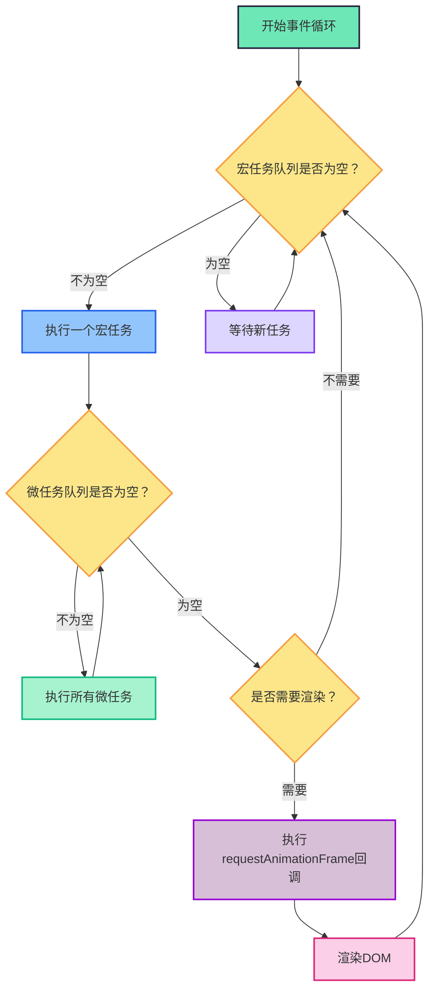
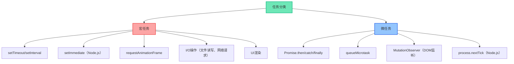
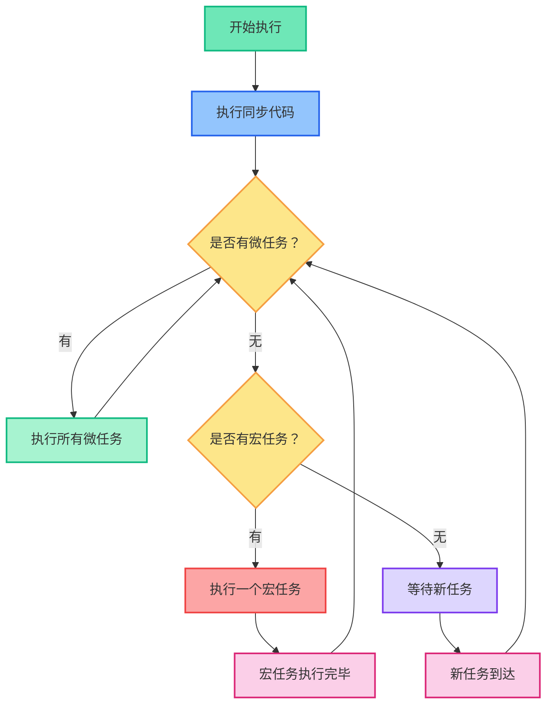
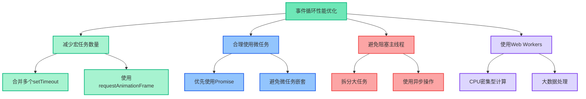
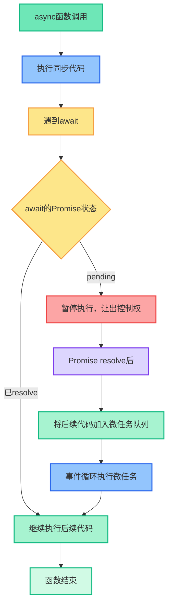

## 什么是事件循环

事件循环（Event Loop）是JavaScript实现异步编程的核心机制，它负责协调各种任务的执行顺序，确保单线程的JavaScript引擎能够高效处理同步和异步代码。

**核心思想：**

- JavaScript是单线程执行模型
- 通过事件循环实现非阻塞异步操作
- **任务分为宏任务和微任务两个层级**
- **每个宏任务执行后，会立即清空整个微任务队列**
- 浏览器渲染（重绘）发生在微任务队列清空后

## 事件循环整体流程




## 任务分类策略




## 事件循环核心机制

```js
// 事件循环的简化实现
function eventLoop() {
  while (true) {
    // 1. 检查并执行一个宏任务
    if (宏任务队列.length > 0) {
      const 当前宏任务 = 宏任务队列.shift()
      执行任务(当前宏任务)
    }

    // 2. 清空微任务队列（重要！）
    while (微任务队列.length > 0) {
      const 当前微任务 = 微任务队列.shift()
      执行任务(当前微任务)
    }

    // 3. 检查是否需要渲染
    if (需要渲染()) {
      // 执行动画回调
      const 动画回调列表 = 获取动画帧回调()
      动画回调列表.forEach(回调 => 回调())

      // 执行实际渲染
      渲染页面()
    }

    // 4. 等待新任务
    if (宏任务队列.length === 0) {
      等待新任务()
    }
  }
}
```

## 宏任务（Macro Task）

宏任务是事件循环中的主要任务类型，每个宏任务执行完毕后，会检查微任务队列。

```js
// 常见的宏任务示例
console.log('1. 同步代码开始')

setTimeout(() => {
  console.log('2. setTimeout 宏任务')
}, 0)

setInterval(() => {
  console.log('3. setInterval 宏任务')
}, 1000)

requestAnimationFrame(() => {
  console.log('4. requestAnimationFrame 宏任务')
})

// I/O操作也是宏任务
fetch('/api/data').then(response => {
  console.log('5. fetch 宏任务完成')
})

console.log('6. 同步代码结束')

// 输出顺序：1, 6, 2, 4, 5, 3...
```

## 微任务（Micro Task）

微任务具有更高的优先级，会在当前宏任务执行完毕后立即执行所有微任务。

```js
// 微任务示例
console.log('1. 同步代码')

Promise.resolve().then(() => {
  console.log('2. Promise.then 微任务')
})

queueMicrotask(() => {
  console.log('3. queueMicrotask 微任务')
})

setTimeout(() => {
  console.log('4. setTimeout 宏任务')
  Promise.resolve().then(() => {
    console.log('5. 宏任务中的微任务')
  })
}, 0)

console.log('6. 同步代码结束')

// 输出顺序：1, 6, 2, 3, 4, 5
```

## 事件循环执行流程详解

### 执行流程图




## 经典面试题分析

### 题目：预测输出顺序

```js
console.log('1. 开始');

setTimeout(() => {
  console.log('2. 第一个setTimeout');
  Promise.resolve().then(() => {
    console.log('3. 第一个Promise');
  });
}, 0);

Promise.resolve().then(() => {
  console.log('4. 第二个Promise');
  setTimeout(() => {
    console.log('5. 第二个setTimeout');
  }, 0);
});

console.log('6. 结束');
```

**执行步骤详解：**

1. **同步代码执行**（第一轮宏任务）
   - 输出 `1. 开始`
   - 输出 `6. 结束`
   - 宏任务队列：添加 `第一个setTimeout`
   - 微任务队列：添加 `第二个Promise`
2. **微任务执行**
   - 执行 `第二个Promise`：输出 `4. 第二个Promise`
   - 宏任务队列：添加 `第二个setTimeout`
   - 微任务队列：空
3. **下一个宏任务执行**
   - 执行 `第一个setTimeout`：输出 `2. 第一个setTimeout`
   - 微任务队列：添加 `第一个Promise`
4. **微任务执行**
   - 执行 `第一个Promise`：输出 `3. 第一个Promise`
5. **最后一个宏任务**
   - 执行 `第二个setTimeout`：输出 `5. 第二个setTimeout`

```markdown
1. 开始
6. 结束
4. 第二个Promise
2. 第一个setTimeout
3. 第一个Promise
5. 第二个setTimeout
```

## 实际应用场景

### 场景1：异步操作优化

```js
// 不好的做法：嵌套回调
function fetchUserData(userId) {
  fetch(`/api/users/${userId}`)
    .then(response => response.json())
    .then(user => {
      fetch(`/api/users/${userId}/posts`)
        .then(response => response.json())
        .then(posts => {
          console.log('用户数据:', user)
          console.log('用户文章:', posts)
        })
    })
}

// 好的做法：使用async/await
async function fetchUserData(userId) {
  try {
    // 并行请求，提高性能
    const [userResponse, postsResponse] = await Promise.all([
      fetch(`/api/users/${userId}`),
      fetch(`/api/users/${userId}/posts`)
    ])

    const user = await userResponse.json()
    const posts = await postsResponse.json()

    console.log('用户数据:', user)
    console.log('用户文章:', posts)
  } catch (error) {
    console.error('获取数据失败:', error)
  }
}
```

### 场景2：DOM更新优化

```js
// 不好的做法：频繁DOM操作
function updateList(items) {
  const list = document.getElementById('list')
  list.innerHTML = '' // 清空列表

  items.forEach(item => {
    const li = document.createElement('li')
    li.textContent = item.name
    list.appendChild(li) // 每次都会触发重排
  })
}

// 好的做法：批量DOM操作
function updateList(items) {
  const list = document.getElementById('list')
  const fragment = document.createDocumentFragment() // 创建文档片段

  items.forEach(item => {
    const li = document.createElement('li')
    li.textContent = item.name
    fragment.appendChild(li) // 添加到片段中，不会触发重排
  })

  list.innerHTML = '' // 一次性清空
  list.appendChild(fragment) // 一次性添加，只触发一次重排
}
```

### 场景3：事件循环控制

```js
// 使用queueMicrotask确保在下一个宏任务之前执行
function processData(data) {
  // 立即处理数据
  const processedData = data.map(item => ({
    ...item,
    processed: true
  }))

  // 使用微任务确保在DOM更新之前执行
  queueMicrotask(() => {
    updateUI(processedData)
  })
}

// 使用setTimeout拆分大任务
function processLargeArray(array) {
  const chunkSize = 1000
  let index = 0

  function processChunk() {
    const chunk = array.slice(index, index + chunkSize)

    // 处理当前块
    chunk.forEach(item => {
      // 复杂的处理逻辑
      processItem(item)
    })

    index += chunkSize

    // 如果还有数据，继续处理
    if (index < array.length) {
      setTimeout(processChunk, 0) // 让出控制权给其他任务
    } else {
      console.log('所有数据处理完成')
    }
  }

  processChunk()
}
```

## 性能优化策略




## 常见陷阱与解决方案

### 陷阱1：微任务无限循环

```js
// 错误示例：微任务无限循环
function infiniteMicroTask() {
  Promise.resolve().then(() => {
    console.log('微任务执行')
    infiniteMicroTask() // 递归调用，导致无限循环
  })
}

// 正确做法：使用计数器或条件控制
function limitedMicroTask(count = 0) {
  if (count >= 10) {
    console.log('达到限制，停止执行')
    return
  }

  Promise.resolve().then(() => {
    console.log(`微任务执行 ${count + 1}`)
    limitedMicroTask(count + 1)
  })
}
```

### 陷阱2：宏任务阻塞渲染

```js
// 错误示例：长时间运行的宏任务
function blockingTask() {
  const start = Date.now()

  // 模拟长时间计算
  while (Date.now() - start < 1000) {
    // 阻塞主线程1秒
  }

  console.log('任务完成')
}

// 正确做法：拆分任务
function nonBlockingTask() {
  const start = Date.now()
  const duration = 1000

  function processChunk() {
    const elapsed = Date.now() - start

    if (elapsed < duration) {
      // 处理一小部分工作
      for (let i = 0; i < 1000; i++) {
        // 少量计算
      }

      // 使用setTimeout让出控制权
      setTimeout(processChunk, 0)
    } else {
      console.log('任务完成')
    }
  }

  processChunk()
}
```

### 陷阱3：Promise链中的错误处理

```js
// 错误示例：缺少错误处理
function riskyOperation() {
  return fetch('/api/data')
    .then(response => response.json())
    .then(data => {
      // 处理数据
      return processData(data)
    })
  // 缺少catch，错误会被静默忽略
}

// 正确做法：添加错误处理
function safeOperation() {
  return fetch('/api/data')
    .then(response => {
      if (!response.ok) {
        throw new Error(`HTTP error! status: ${response.status}`)
      }
      return response.json()
    })
    .then(data => {
      return processData(data)
    })
    .catch(error => {
      console.error('操作失败:', error)
      // 可以返回默认值或重新抛出错误
      throw error
    })
}
```

## 面试总结

- JavaScript是单线程执行模型，通过事件循环实现异步
- 事件循环顺序：同步代码 → 微任务 → 宏任务 → 渲染
- 微任务优先级高于宏任务，会在当前宏任务后立即执行
- 常见的微任务：Promise.then、queueMicrotask、MutationObserver
- 常见的宏任务：setTimeout、setInterval、I/O操作、UI渲染
- 性能优化：减少宏任务、合理使用微任务、避免阻塞主线程

## async/await在事件循环中的表现

### async/await是宏任务还是微任务？

async/await本质上是Promise的语法糖，所以：

- async函数中的同步代码立即执行
- await后面的表达式是同步执行的
- await后面的代码相当于放在Promise.then中（微任务）

```javascript
async function example() {
  console.log('1. 同步代码');
  await Promise.resolve(); // 这里创建微任务
  console.log('2. 相当于微任务');
}
```

### async/await的本质

async/await是Promise的语法糖，本质上仍然是基于微任务机制。

```js
// async/await示例
async function asyncExample() {
  console.log('1. async函数开始')

  const result = await fetch('/api/data') // await会暂停执行
  console.log('2. await后的代码')

  return result
}

// 等价于Promise写法
function promiseExample() {
  console.log('1. Promise函数开始')

  return fetch('/api/data').then(result => {
    console.log('2. then中的代码')
    return result
  })
}
```

### await的执行机制

```js
// 深入理解await的执行顺序
console.log('1. 同步代码开始')

async function testAwait() {
  console.log('2. async函数内部开始')

  await Promise.resolve('resolved') // 微任务
  console.log('3. 第一个await后')

  await new Promise(resolve => {
    setTimeout(resolve, 0) // 宏任务
  })
  console.log('4. 第二个await后')
}

testAwait()

console.log('5. 同步代码结束')

// 输出顺序：1, 2, 5, 3, 4
// 解释：
// 1. 同步代码执行：1, 2, 5
// 2. 第一个await：Promise.resolve()是微任务，立即执行：3
// 3. 第二个await：setTimeout是宏任务，延迟执行：4
```

### 复杂async/await示例

```js
// 复杂的async/await执行顺序
console.log('1. 开始')

async function complexAsync() {
  console.log('2. async函数开始')

  // 立即resolve的Promise
  const result1 = await Promise.resolve('immediate')
  console.log('3. 立即resolve:', result1)

  // 延迟resolve的Promise
  const result2 = await new Promise(resolve => {
    console.log('4. 创建延迟Promise')
    setTimeout(() => {
      console.log('5. 延迟Promise resolve')
      resolve('delayed')
    }, 0)
  })
  console.log('6. 延迟resolve:', result2)

  // 嵌套的async调用
  const result3 = await nestedAsync()
  console.log('7. 嵌套async结果:', result3)
}

async function nestedAsync() {
  console.log('8. 嵌套async开始')
  await Promise.resolve('nested')
  console.log('9. 嵌套async结束')
  return 'nested result'
}

complexAsync()

console.log('10. 结束')

// 1 2 10 3 4 5 6 8 9 7
```
### 执行步骤详解

#### 阶段1：同步代码执行（宏任务）

1. `console.log('1. 开始')` → 输出：**1. 开始**
2. 定义`complexAsync`和`nestedAsync`函数（不执行内部代码）
3. 调用`complexAsync()` → 进入函数体
4. `console.log('2. async函数开始')` → 输出：**2. async函数开始**
5. 遇到第一个`await Promise.resolve('immediate')`
   - 创建一个立即解决的Promise
   - **await会暂停函数执行**，将后面的代码包装成微任务
6. 跳出async函数，继续执行外部同步代码
7. `console.log('10. 结束')` → 输出：**10. 结束**

**当前输出：**  

```md
1. 开始  
2. async函数开始  
10. 结束  
```

#### 阶段2：微任务执行

8. 执行第一个await后的微任务：
   - `console.log('3. 立即resolve:', result1)` → 输出：**3. 立即resolve: immediate**
9. 遇到第二个`await new Promise(...)`
   - 执行Promise构造函数中的同步代码：`console.log('4. 创建延迟Promise')` → 输出：**4. 创建延迟Promise**
   - `setTimeout`将回调加入**宏任务队列**
   - **await再次暂停函数执行**，将后续代码包装成微任务（但需等待Promise解决）

**当前输出：**  

```md
1. 开始  
2. async函数开始  
10. 结束  
4. 立即resolve: immediate  
```
#### 阶段3：宏任务执行（setTimeout）

10. 执行setTimeout回调：
    - `console.log('5. 延迟Promise resolve')` → 输出：**5. 延迟Promise resolve**
    - 调用`resolve('delayed')`解决Promise

#### 阶段4：微任务执行（续）

11. Promise解决后，执行第二个await后的微任务：
    - `console.log('6. 延迟resolve:', result2)` → 输出：**6. 延迟resolve: delayed**
12. 遇到第三个`await nestedAsync()` → 调用嵌套async函数
13. 进入`nestedAsync()`函数：
    - `console.log('8. 嵌套async开始')` → 输出：**8. 嵌套async开始**
    - 遇到`await Promise.resolve('nested')` → 将后续代码包装成微任务

#### 阶段5：微任务执行（嵌套async）

14. 执行`nestedAsync`中的微任务：
    - `console.log('9. 嵌套async结束')` → 输出：**9. 嵌套async结束**
    - 返回`'nested result'`解决Promise
15. `nestedAsync`的Promise解决后，执行第三个await后的微任务：
    - `console.log('7. 嵌套async结果:', result3)` → 输出：**7. 嵌套async结果: nested result**

#### 最终输出顺序

```md
1. 开始
2. async函数开始
10. 结束
3. 立即resolve: immediate
4. 创建延迟Promise
5. 延迟Promise resolve
6. 延迟resolve: delayed
8. 嵌套async开始
9. 嵌套async结束
7. 嵌套async结果: nested result
```

### async/await与事件循环的关系




### 实际应用中的注意事项

```js
// 错误示例：在循环中使用await
async function wrongLoop() {
  const urls = ['url1', 'url2', 'url3']

  for (const url of urls) {
    const response = await fetch(url) // 串行执行，效率低
    console.log(await response.json())
  }
}

// 正确做法：并行执行
async function correctLoop() {
  const urls = ['url1', 'url2', 'url3']

  // 并行发起所有请求
  const promises = urls.map(url => fetch(url))
  const responses = await Promise.all(promises)

  // 并行处理所有响应
  const results = await Promise.all(responses.map(response => response.json()))

  results.forEach(result => console.log(result))
}

// 错误处理
async function errorHandling() {
  try {
    const response = await fetch('/api/data')

    if (!response.ok) {
      throw new Error(`HTTP error! status: ${response.status}`)
    }

    const data = await response.json()
    return data
  } catch (error) {
    console.error('请求失败:', error)
    // 可以返回默认值
    return { error: true, message: error.message }
  }
}
```

### 性能优化建议

```js
// 1. 避免不必要的await
// 不好的做法
async function badPractice() {
  const data = await Promise.resolve('data') // 不必要的await
  return data
}

// 好的做法
async function goodPractice() {
  return Promise.resolve('data') // 直接返回Promise
}

// 2. 合理使用Promise.all和Promise.race
async function optimizedRequests() {
  const promises = [fetch('/api/users'), fetch('/api/posts'), fetch('/api/comments')]

  // 等待所有请求完成
  const [users, posts, comments] = await Promise.all(promises)

  // 或者只等待第一个完成的请求
  const firstResponse = await Promise.race(promises)

  return { users, posts, comments, firstResponse }
}

// 3. 使用AbortController控制请求
async function controlledRequest() {
  const controller = new AbortController()
  const timeoutId = setTimeout(() => controller.abort(), 5000) // 5秒超时

  try {
    const response = await fetch('/api/data', {
      signal: controller.signal
    })
    clearTimeout(timeoutId)
    return await response.json()
  } catch (error) {
    if (error.name === 'AbortError') {
      console.log('请求超时')
    }
    throw error
  }
}
```
