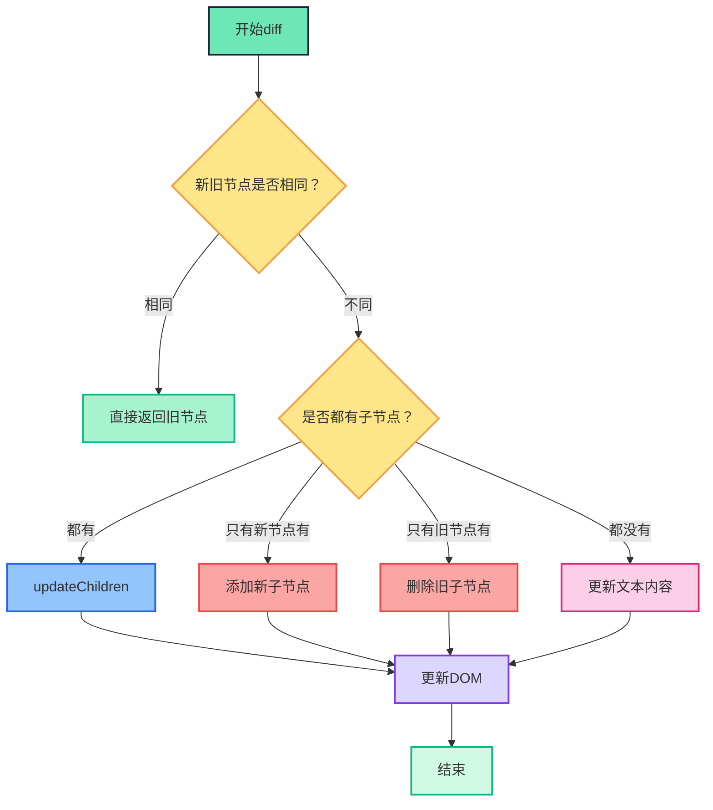
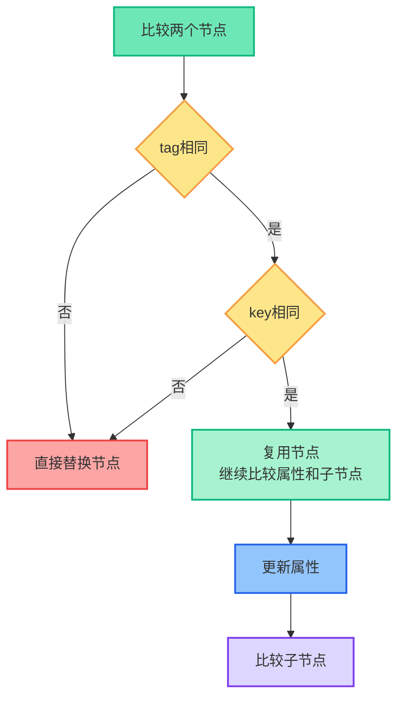
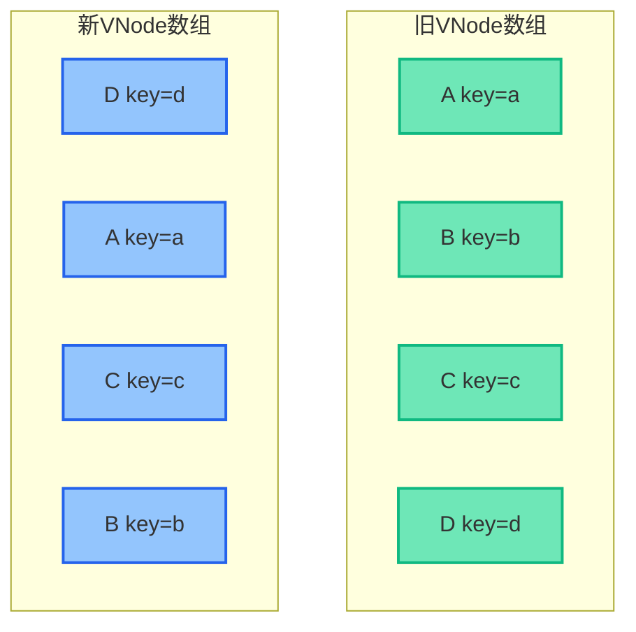
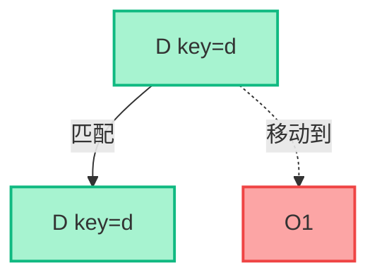
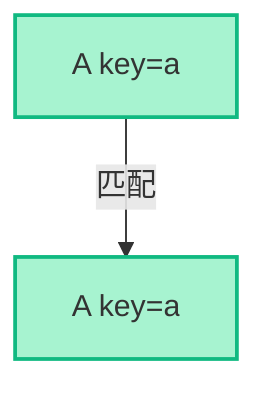
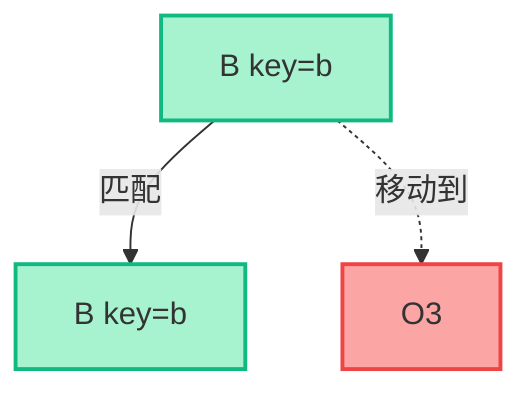
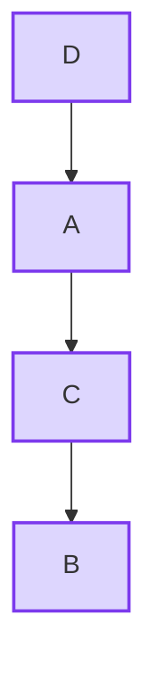
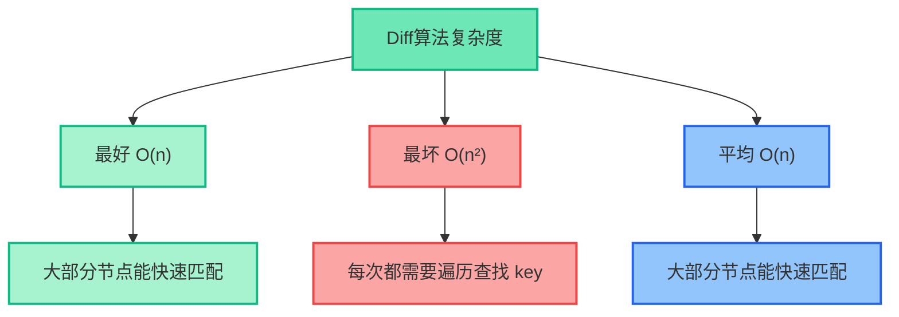

# Vue2 Diff算法原理详解

## 什么是Diff算法

Diff算法是Virtual DOM的核心，用来比较新旧虚拟节点树的差异，并以最小的代价更新真实DOM。

**核心思想：**

- 只比较同一层级的节点，不会跨层级
- 先判断节点类型是否相同
- 通过key值快速识别可复用的节点

---

## Diff算法整体流程



## 节点比较策略



## patch函数 - 入口函数

```js
function patch(oldVnode, vnode) {
  if (sameVnode(oldVnode, vnode)) {
    patchVnode(oldVnode, vnode)
  } else {
    const oEl = oldVnode.el
    let parentEle = api.parentNode(oEl)
    createEle(vnode)
    if (parentEle !== null) {
      api.insertBefore(parentEle, vnode.el, api.nextSibling(oEl))
      api.removeChild(parentEle, oldVnode.el)
      oldVnode = null
    }
  }
  return vnode
}
```

---

## sameVnode - 判断是否为相同节点

```js
function sameVnode(a, b) {
  return (
    a.key === b.key &&
    a.tag === b.tag &&
    a.isComment === b.isComment &&
    isDef(a.data) === isDef(b.data) &&
    sameInputType(a, b)
  )
}
```

---

## patchVnode - 比较相同节点

```js
function patchVnode(oldVnode, vnode) {
  const el = (vnode.el = oldVnode.el)
  if (oldVnode === vnode) return
  updateAttrs(oldVnode, vnode)
  const oldCh = oldVnode.children
  const ch = vnode.children
  if (isUndef(vnode.text)) {
    if (isDef(oldCh) && isDef(ch)) {
      if (oldCh !== ch) updateChildren(el, oldCh, ch)
    } else if (isDef(ch)) {
      if (isDef(oldVnode.text)) api.setTextContent(el, '')
      addVnodes(el, null, ch, 0, ch.length - 1)
    } else if (isDef(oldCh)) {
      removeVnodes(el, oldCh, 0, oldCh.length - 1)
    } else if (isDef(oldVnode.text)) {
      api.setTextContent(el, '')
    }
  } else if (oldVnode.text !== vnode.text) {
    api.setTextContent(el, vnode.text)
  }
}
```

---

## updateChildren - 双端比较算法

### 算法流程图


---

## 逐步对比演示

### 例子：从 [A, B, C, D] 变成 [D, A, C, B]

#### 初始状态



#### 步骤1：尾头比较 D vs D，匹配，移动D到A前面



操作：`insertBefore(D, A)`，指针移动 oldEnd--, newStart++

#### 步骤2：头头比较 A vs A，匹配，指针右移



#### 步骤3：头尾比较 B vs B，匹配，移动B到C后面



#### 步骤4：头头比较 C vs C，匹配，指针右移


#### 最终结果



---

## updateChildren核心代码

```js
function updateChildren(parentElm, oldCh, newCh) {
  let oldStartIdx = 0
  let newStartIdx = 0
  let oldEndIdx = oldCh.length - 1
  let oldStartVnode = oldCh[0]
  let oldEndVnode = oldCh[oldEndIdx]
  let newEndIdx = newCh.length - 1
  let newStartVnode = newCh[0]
  let newEndVnode = newCh[newEndIdx]
  let oldKeyToIdx, idxInOld, vnodeToMove, refElm

  function createKeyToOldIdx(children, beginIdx, endIdx) {
    let i, key
    const map = {}
    for (i = beginIdx; i <= endIdx; ++i) {
      key = children[i].key
      if (isDef(key)) map[key] = i
    }
    return map
  }

  while (oldStartIdx <= oldEndIdx && newStartIdx <= newEndIdx) {
    if (isUndef(oldStartVnode)) {
      oldStartVnode = oldCh[++oldStartIdx]
    } else if (isUndef(oldEndVnode)) {
      oldEndVnode = oldCh[--oldEndIdx]
    } else if (sameVnode(oldStartVnode, newStartVnode)) {
      patchVnode(oldStartVnode, newStartVnode)
      oldStartVnode = oldCh[++oldStartIdx]
      newStartVnode = newCh[++newStartIdx]
    } else if (sameVnode(oldEndVnode, newEndVnode)) {
      patchVnode(oldEndVnode, newEndVnode)
      oldEndVnode = oldCh[--oldEndIdx]
      newEndVnode = newCh[--newEndIdx]
    } else if (sameVnode(oldStartVnode, newEndVnode)) {
      patchVnode(oldStartVnode, newEndVnode)
      api.insertBefore(parentElm, oldStartVnode.el, api.nextSibling(oldEndVnode.el))
      oldStartVnode = oldCh[++oldStartIdx]
      newEndVnode = newCh[--newEndIdx]
    } else if (sameVnode(oldEndVnode, newStartVnode)) {
      patchVnode(oldEndVnode, newStartVnode)
      api.insertBefore(parentElm, oldEndVnode.el, oldStartVnode.el)
      oldEndVnode = oldCh[--oldEndIdx]
      newStartVnode = newCh[++newStartIdx]
    } else {
      if (isUndef(oldKeyToIdx)) {
        oldKeyToIdx = createKeyToOldIdx(oldCh, oldStartIdx, oldEndIdx)
      }
      idxInOld = isDef(newStartVnode.key)
        ? oldKeyToIdx[newStartVnode.key]
        : findIdxInOld(newStartVnode, oldCh, oldStartIdx, oldEndIdx)
      if (isUndef(idxInOld)) {
        createElm(newStartVnode, parentElm, oldStartVnode.el)
      } else {
        vnodeToMove = oldCh[idxInOld]
        if (sameVnode(vnodeToMove, newStartVnode)) {
          patchVnode(vnodeToMove, newStartVnode)
          oldCh[idxInOld] = undefined
          api.insertBefore(parentElm, vnodeToMove.el, oldStartVnode.el)
        } else {
          createElm(newStartVnode, parentElm, oldStartVnode.el)
        }
      }
      newStartVnode = newCh[++newStartIdx]
    }
  }
  if (oldStartIdx > oldEndIdx) {
    refElm = isUndef(newCh[newEndIdx + 1]) ? null : newCh[newEndIdx + 1].el
    addVnodes(parentElm, refElm, newCh, newStartIdx, newEndIdx)
  } else if (newStartIdx > newEndIdx) {
    removeVnodes(parentElm, oldCh, oldStartIdx, oldEndIdx)
  }
}
```

---

## key的重要性对比

```js
// 没有key的情况
<ul>
  <li>张三</li>
  <li>李四</li>
  <li>王五</li>
</ul>

// 插入一个新项到开头
<ul>
  <li>赵六</li>
  <li>张三</li>
  <li>李四</li>
  <li>王五</li>
</ul>
// 需要修改3个节点 + 创建1个节点

// 有key的情况
<ul>
  <li key="zhang">张三</li>
  <li key="li">李四</li>
  <li key="wang">王五</li>
</ul>

// 插入一个新项到开头
<ul>
  <li key="zhao">赵六</li>
  <li key="zhang">张三</li>
  <li key="li">李四</li>
  <li key="wang">王五</li>
</ul>
// 只需创建1个节点，其他节点直接复用
```

---

## 算法复杂度与优化



---

## 面试总结

- Vue2 diff算法只做同层比较，避免O(n³)复杂度
- 采用双端比较（头头、尾尾、头尾、尾头）+ key查找，平均O(n)
- key的作用是帮助节点复用，提升性能，避免状态错乱
- 实际开发中，key应选用唯一且稳定的标识
- Vue3在此基础上引入了最长递增子序列优化节点移动

---

**记忆口诀：**

- 同层比较不跨级
- 双端比较四种情况
- key值定位要精确
- 就地复用性能好

---

这就是Vue2 Diff算法的核心原理和执行流程，配合流程图和例子，面试时可以自信讲解。
