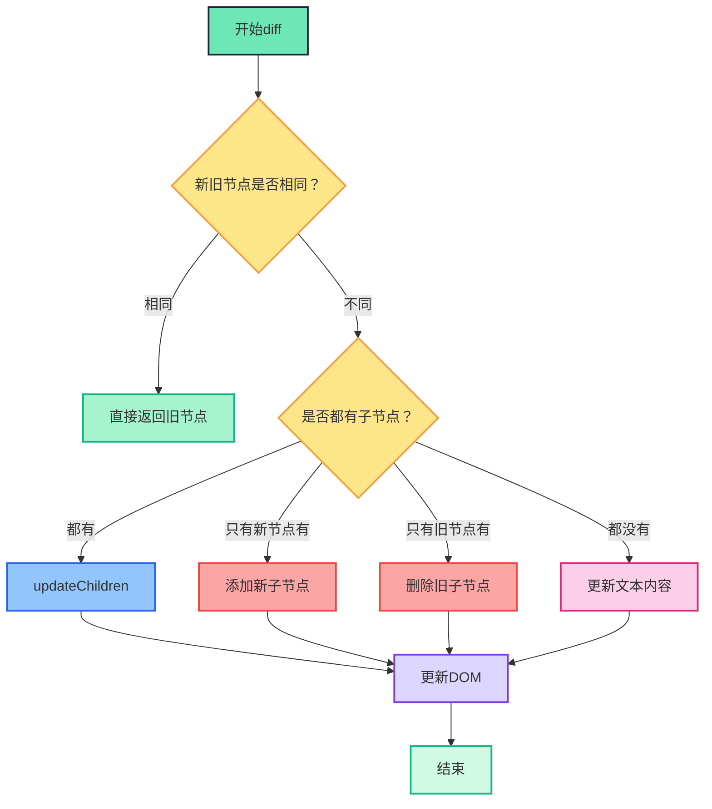
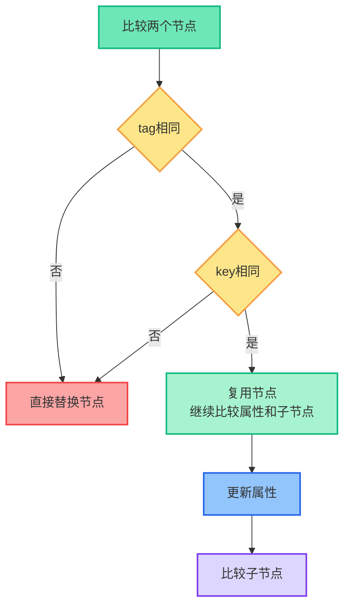
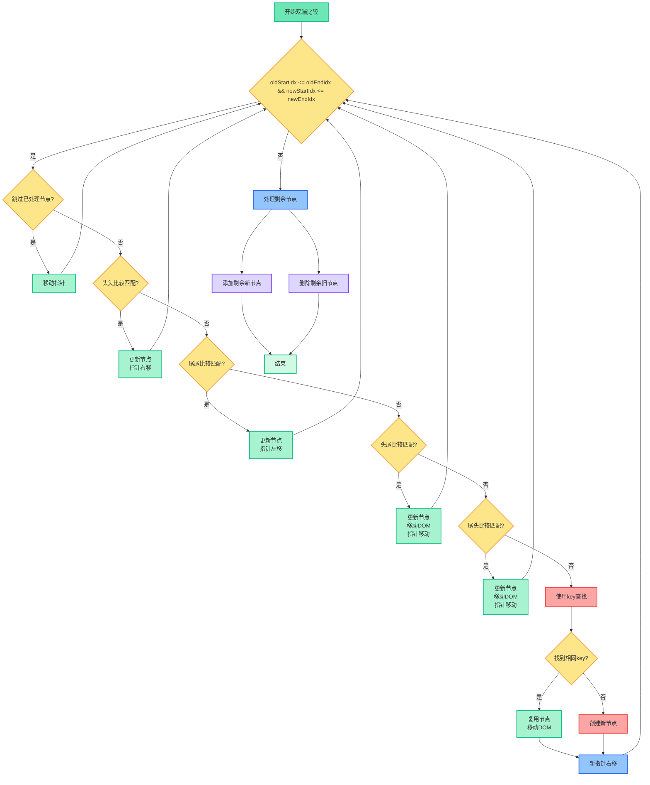
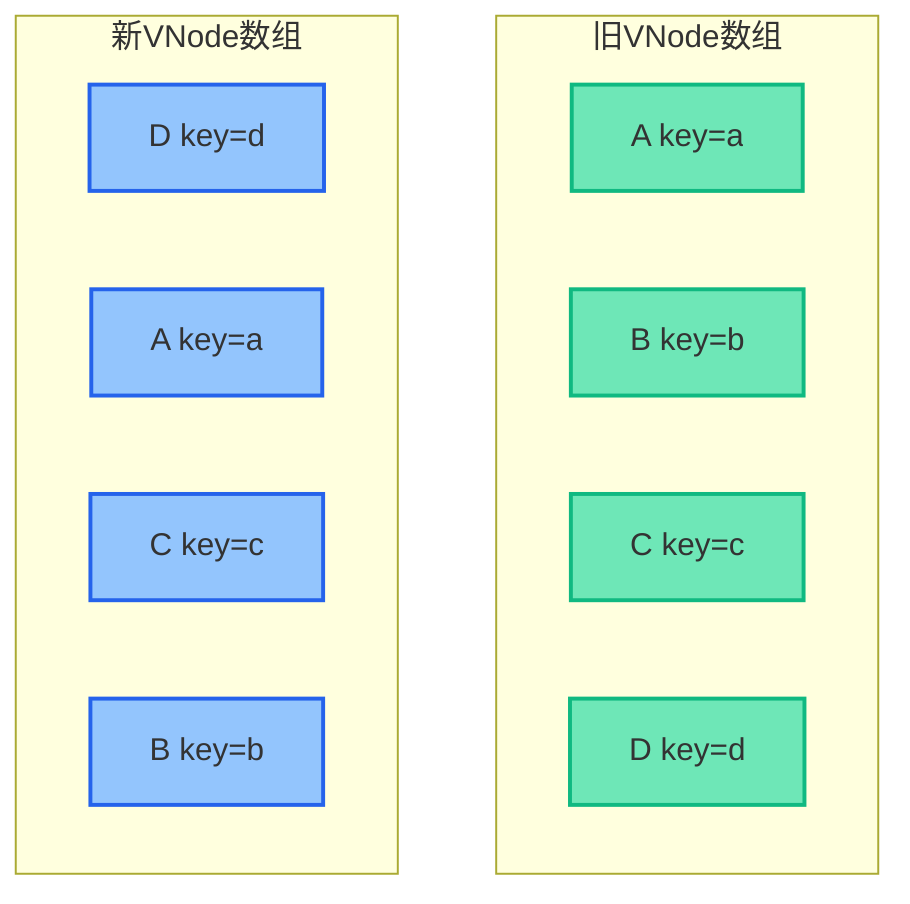
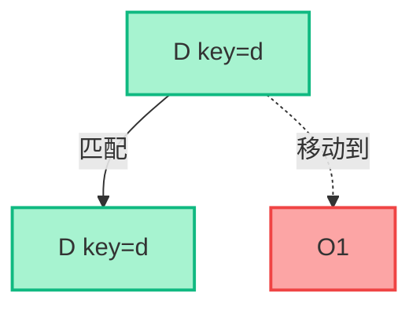
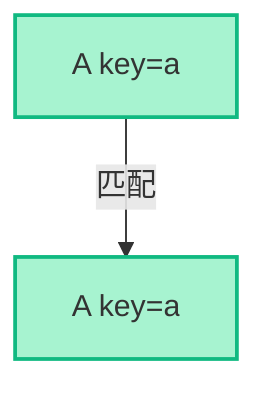
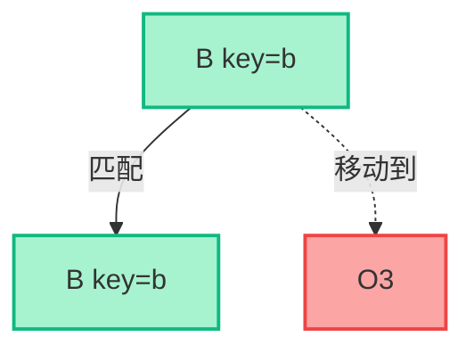
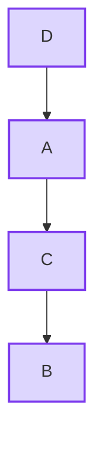
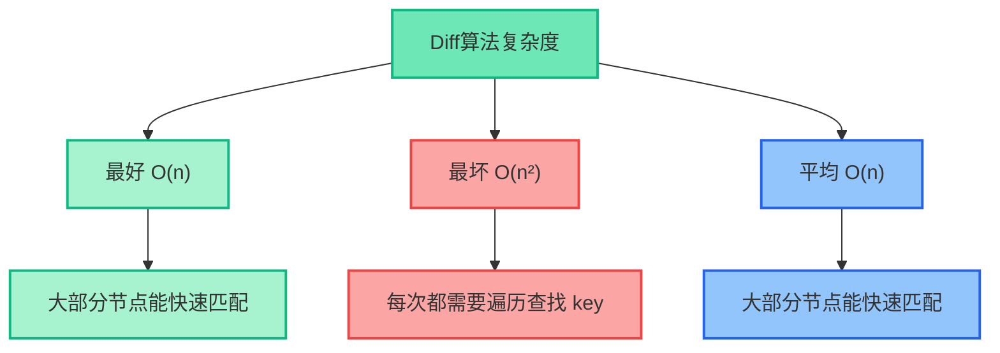

## 什么是Diff算法

Diff算法是Virtual DOM的核心，用来比较新旧虚拟节点树的差异，并以最小的代价更新真实DOM。

**核心思想：**

- 只比较同一层级的节点，不会跨层级
- 先判断节点类型是否相同
- 通过key值快速识别可复用的节点

## Diff算法整体流程




## 节点比较策略




## patch函数 - 入口函数

```js
function patch(oldVnode, vnode) {
  // 判断新旧节点是否为相同节点（通过key、tag等属性判断）
  if (sameVnode(oldVnode, vnode)) {
    // 相同节点，执行patchVnode进行深度比较和更新
    patchVnode(oldVnode, vnode)
  } else {
    // 不同节点，直接替换整个节点
    const oEl = oldVnode.el // 获取旧节点的真实DOM元素
    let parentEle = api.parentNode(oEl) // 获取父节点
    createEle(vnode) // 创建新节点的真实DOM
    if (parentEle !== null) {
      // 将新节点插入到旧节点之前
      api.insertBefore(parentEle, vnode.el, api.nextSibling(oEl))
      // 删除旧节点
      api.removeChild(parentEle, oldVnode.el)
      oldVnode = null // 清空旧节点引用
    }
  }
  return vnode
}
```

## sameVnode - 判断是否为相同节点

```js
function sameVnode(a, b) {
  return (
    a.key === b.key && // key值必须相同
    a.tag === b.tag && // 标签名必须相同
    a.isComment === b.isComment && // 注释节点类型必须相同
    isDef(a.data) === isDef(b.data) && // data属性存在性必须相同
    sameInputType(a, b) // 如果是input元素，type必须相同
  )
}
```

## patchVnode - 比较相同节点

```js
function patchVnode(oldVnode, vnode) {
  // 复用旧节点的真实DOM元素
  const el = (vnode.el = oldVnode.el)

  // 如果新旧节点完全相同，直接返回
  if (oldVnode === vnode) return

  // 更新节点的属性（class、style、事件等）
  updateAttrs(oldVnode, vnode)

  // 获取新旧节点的子节点
  const oldCh = oldVnode.children
  const ch = vnode.children

  // 如果新节点不是文本节点
  if (isUndef(vnode.text)) {
    // 情况1：新旧节点都有子节点
    if (isDef(oldCh) && isDef(ch)) {
      if (oldCh !== ch) updateChildren(el, oldCh, ch) // 执行子节点diff
    }
    // 情况2：只有新节点有子节点
    else if (isDef(ch)) {
      if (isDef(oldVnode.text)) api.setTextContent(el, '') // 清空旧文本
      addVnodes(el, null, ch, 0, ch.length - 1) // 添加新子节点
    }
    // 情况3：只有旧节点有子节点
    else if (isDef(oldCh)) {
      removeVnodes(el, oldCh, 0, oldCh.length - 1) // 删除旧子节点
    }
    // 情况4：都没有子节点，但旧节点有文本
    else if (isDef(oldVnode.text)) {
      api.setTextContent(el, '') // 清空文本
    }
  }
  // 如果新节点是文本节点，且文本内容不同
  else if (oldVnode.text !== vnode.text) {
    api.setTextContent(el, vnode.text) // 更新文本内容
  }
}
```

## updateChildren - 双端比较算法

### 算法流程图




## 逐步对比演示

### 例子：从 [A, B, C, D] 变成 [D, A, C, B]

#### 初始状态




#### 步骤1：尾头比较 D vs D，匹配，移动D到A前面




操作：`insertBefore(D, A)`，指针移动 oldEnd--, newStart++

#### 步骤2：头头比较 A vs A，匹配，指针右移




#### 步骤3：头尾比较 B vs B，匹配，移动B到C后面




#### 步骤4：头头比较 C vs C，匹配，指针右移


#### 最终结果




## updateChildren核心代码

```js
function updateChildren(parentElm, oldCh, newCh) {
  // 初始化双端比较的指针
  let oldStartIdx = 0 // 旧子节点数组的起始索引
  let newStartIdx = 0 // 新子节点数组的起始索引
  let oldEndIdx = oldCh.length - 1 // 旧子节点数组的结束索引
  let oldStartVnode = oldCh[0] // 旧子节点数组的第一个节点
  let oldEndVnode = oldCh[oldEndIdx] // 旧子节点数组的最后一个节点
  let newEndIdx = newCh.length - 1 // 新子节点数组的结束索引
  let newStartVnode = newCh[0] // 新子节点数组的第一个节点
  let newEndVnode = newCh[newEndIdx] // 新子节点数组的最后一个节点

  // 用于key查找的辅助变量
  let oldKeyToIdx, idxInOld, vnodeToMove, refElm

  // 创建key到索引的映射表，用于快速查找
  function createKeyToOldIdx(children, beginIdx, endIdx) {
    let i, key
    const map = {}
    for (i = beginIdx; i <= endIdx; ++i) {
      key = children[i].key
      if (isDef(key)) map[key] = i // 将key作为键，索引作为值
    }
    return map
  }

  // 双端比较的主循环
  while (oldStartIdx <= oldEndIdx && newStartIdx <= newEndIdx) {
    // 情况1：跳过已处理的旧节点（被设置为undefined）
    if (isUndef(oldStartVnode)) {
      oldStartVnode = oldCh[++oldStartIdx]
    } else if (isUndef(oldEndVnode)) {
      oldEndVnode = oldCh[--oldEndIdx]
    }
    // 情况2：头头比较 - 新旧起始节点相同
    else if (sameVnode(oldStartVnode, newStartVnode)) {
      patchVnode(oldStartVnode, newStartVnode) // 更新节点
      oldStartVnode = oldCh[++oldStartIdx] // 旧起始指针右移
      newStartVnode = newCh[++newStartIdx] // 新起始指针右移
    }
    // 情况3：尾尾比较 - 新旧结束节点相同
    else if (sameVnode(oldEndVnode, newEndVnode)) {
      patchVnode(oldEndVnode, newEndVnode) // 更新节点
      oldEndVnode = oldCh[--oldEndIdx] // 旧结束指针左移
      newEndVnode = newCh[--newEndIdx] // 新结束指针左移
    }
    // 情况4：头尾比较 - 旧起始节点与新结束节点相同
    else if (sameVnode(oldStartVnode, newEndVnode)) {
      patchVnode(oldStartVnode, newEndVnode) // 更新节点
      // 将旧起始节点移动到旧结束节点之后
      api.insertBefore(parentElm, oldStartVnode.el, api.nextSibling(oldEndVnode.el))
      oldStartVnode = oldCh[++oldStartIdx] // 旧起始指针右移
      newEndVnode = newCh[--newEndIdx] // 新结束指针左移
    }
    // 情况5：尾头比较 - 旧结束节点与新起始节点相同
    else if (sameVnode(oldEndVnode, newStartVnode)) {
      patchVnode(oldEndVnode, newStartVnode) // 更新节点
      // 将旧结束节点移动到旧起始节点之前
      api.insertBefore(parentElm, oldEndVnode.el, oldStartVnode.el)
      oldEndVnode = oldCh[--oldEndIdx] // 旧结束指针左移
      newStartVnode = newCh[++newStartIdx] // 新起始指针右移
    }
    // 情况6：四种双端比较都不匹配，使用key查找
    else {
      // 懒加载创建key映射表
      if (isUndef(oldKeyToIdx)) {
        oldKeyToIdx = createKeyToOldIdx(oldCh, oldStartIdx, oldEndIdx)
      }

      // 根据新起始节点的key在旧节点中查找
      idxInOld = isDef(newStartVnode.key)
        ? oldKeyToIdx[newStartVnode.key] // 有key时直接查找
        : findIdxInOld(newStartVnode, oldCh, oldStartIdx, oldEndIdx) // 无key时遍历查找

      // 在旧节点中找不到相同key的节点
      if (isUndef(idxInOld)) {
        createElm(newStartVnode, parentElm, oldStartVnode.el) // 创建新节点
      } else {
        // 找到了相同key的旧节点
        vnodeToMove = oldCh[idxInOld]
        if (sameVnode(vnodeToMove, newStartVnode)) {
          // 节点类型也相同，可以复用
          patchVnode(vnodeToMove, newStartVnode) // 更新节点
          oldCh[idxInOld] = undefined // 标记旧节点已处理
          api.insertBefore(parentElm, vnodeToMove.el, oldStartVnode.el) // 移动到新位置
        } else {
          // 节点类型不同，创建新节点
          createElm(newStartVnode, parentElm, oldStartVnode.el)
        }
      }
      newStartVnode = newCh[++newStartIdx] // 新起始指针右移
    }
  }

  // 处理剩余节点
  if (oldStartIdx > oldEndIdx) {
    // 旧节点处理完毕，新节点还有剩余，需要添加
    refElm = isUndef(newCh[newEndIdx + 1]) ? null : newCh[newEndIdx + 1].el
    addVnodes(parentElm, refElm, newCh, newStartIdx, newEndIdx)
  } else if (newStartIdx > newEndIdx) {
    // 新节点处理完毕，旧节点还有剩余，需要删除
    removeVnodes(parentElm, oldCh, oldStartIdx, oldEndIdx)
  }
}
```

## key的重要性对比

```js
// ===== 没有key的情况 =====
// 初始状态
<ul>
  <li>张三</li>  <!-- 索引0 -->
  <li>李四</li>  <!-- 索引1 -->
  <li>王五</li>  <!-- 索引2 -->
</ul>

// 插入一个新项到开头后
<ul>
  <li>赵六</li>  <!-- 新索引0，但Vue会按位置比较 -->
  <li>张三</li>  <!-- 新索引1，与旧索引0比较，内容不同，更新 -->
  <li>李四</li>  <!-- 新索引2，与旧索引1比较，内容不同，更新 -->
  <li>王五</li>  <!-- 新索引3，与旧索引2比较，内容不同，更新 -->
</ul>
// 结果：需要修改3个节点的内容 + 创建1个新节点
// 性能开销：4次DOM操作

// ===== 有key的情况 =====
// 初始状态
<ul>
  <li key="zhang">张三</li>  <!-- key="zhang" -->
  <li key="li">李四</li>     <!-- key="li" -->
  <li key="wang">王五</li>   <!-- key="wang" -->
</ul>

// 插入一个新项到开头后
<ul>
  <li key="zhao">赵六</li>   <!-- 新key="zhao"，在旧数组中找不到，创建新节点 -->
  <li key="zhang">张三</li>  <!-- key="zhang"，找到旧节点，直接复用 -->
  <li key="li">李四</li>     <!-- key="li"，找到旧节点，直接复用 -->
  <li key="wang">王五</li>   <!-- key="wang"，找到旧节点，直接复用 -->
</ul>
// 结果：只需创建1个新节点，其他3个节点直接复用
// 性能开销：1次DOM操作 + 3次节点移动

// ===== 性能对比总结 =====
// 无key：4次DOM操作（3次更新 + 1次创建）
// 有key：4次DOM操作（1次创建 + 3次移动）
// 虽然都是4次操作，但移动比更新更高效，且避免了不必要的状态重置
```

## 算法复杂度与优化




## 面试总结

- Vue2 diff算法只做同层比较，避免O(n³)复杂度
- 采用双端比较（头头、尾尾、头尾、尾头）+ key查找，平均O(n)
- key的作用是帮助节点复用，提升性能，避免状态错乱
- 实际开发中，key应选用唯一且稳定的标识
- Vue3在此基础上引入了最长递增子序列优化节点移动

**记忆口诀：**

- 同层比较不跨级
- 双端比较四种情况
- key值定位要精确
- 就地复用性能好