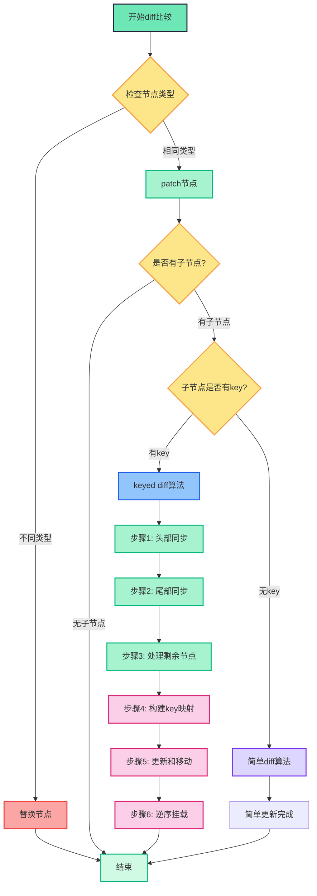
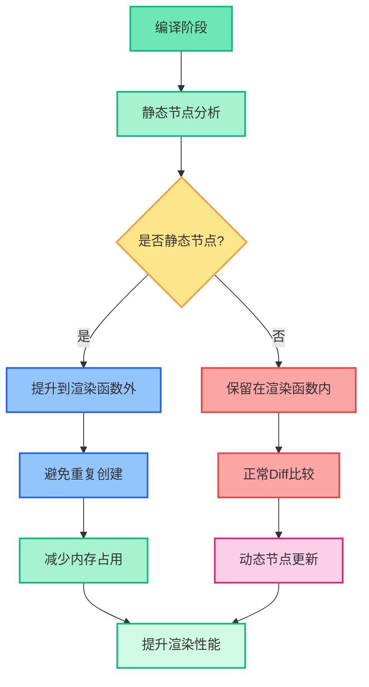
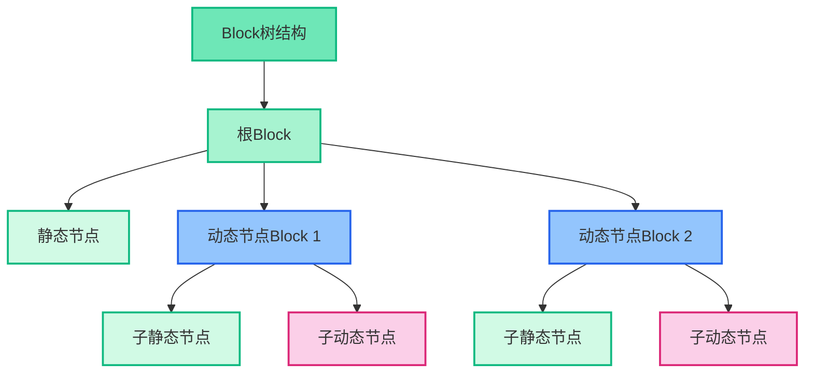
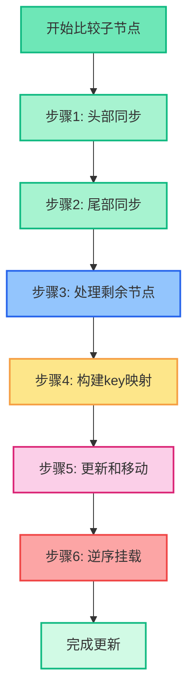
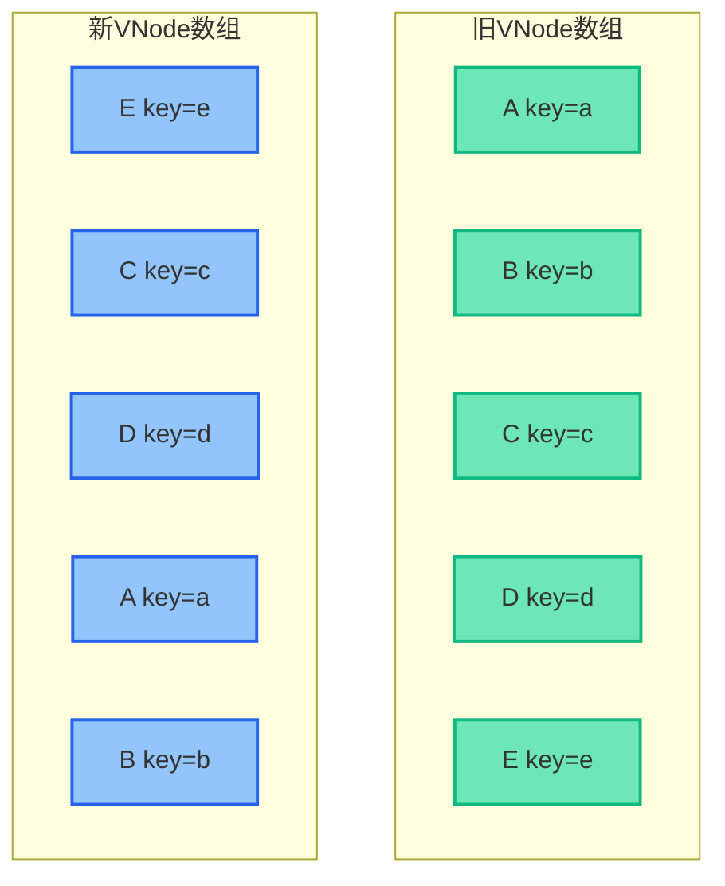
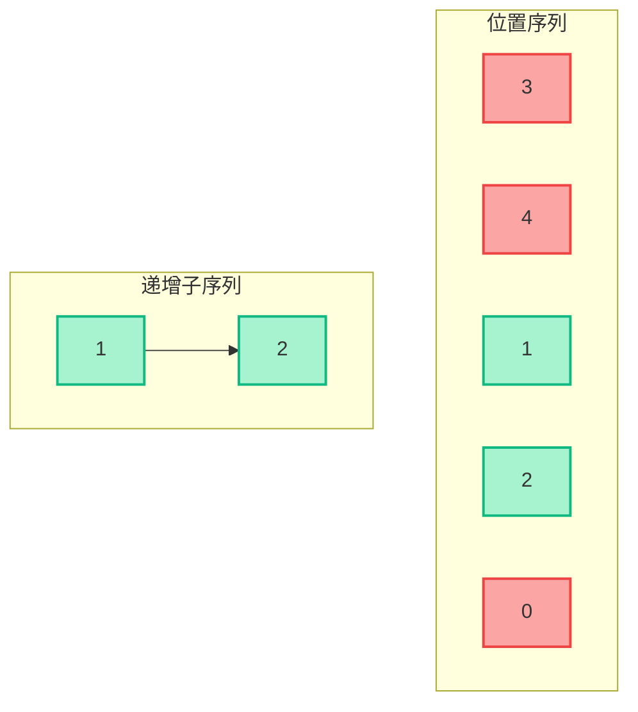
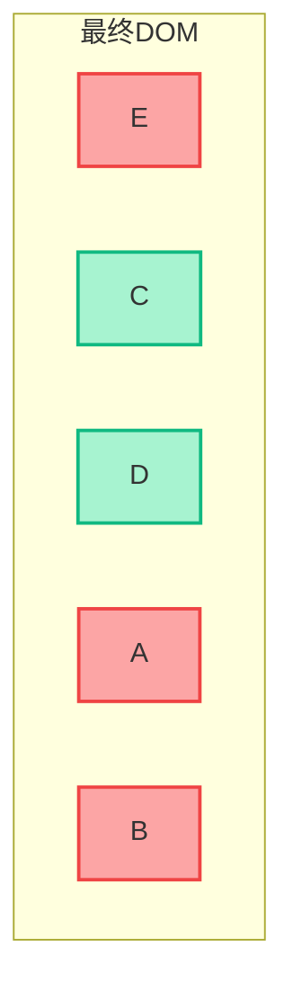

# Vue3 Diff算法原理详解

## 什么是Vue3的Diff算法

Vue3的Diff算法是对Vue2算法的重大优化，它通过静态节点提升、最长递增子序列等创新方法，进一步提高了虚拟DOM比较和更新的效率。

**核心优化：**

- 静态节点标记和提升
- 基于最长递增子序列的移动优化
- 更细粒度的Block树结构
- 编译时优化与运行时结合

## Diff算法整体流程




## 静态节点提升




## PatchFlag机制

```js
// Vue3 编译后的渲染函数
function render() {
  return (
    _openBlock(),
    _createElementBlock('div', null, [
      // 静态节点，不需要diff
      _createElementVNode('h1', null, '标题永远不变'),

      // 动态文本，PatchFlag为1
      _createElementVNode('p', null, _toDisplayString(message), 1 /* TEXT */),

      // 动态class，PatchFlag为2
      _createElementVNode(
        'div',
        {
          class: _normalizeClass({ active: isActive })
        },
        null,
        2 /* CLASS */
      ),

      // 动态style，PatchFlag为4
      _createElementVNode(
        'span',
        {
          style: _normalizeStyle({ color: textColor })
        },
        null,
        4 /* STYLE */
      ),

      // 多个动态属性，PatchFlag为8
      _createElementVNode(
        'input',
        {
          value: value,
          disabled: isDisabled
        },
        null,
        8 /* PROPS */,
        ['value', 'disabled']
      )
    ])
  )
}
```

## Block树结构




## 最长递增子序列算法详解

### 算法步骤拆解




### 详细步骤说明

#### 步骤1: 头部同步

从头部开始，比较相同位置的节点，如果类型相同则更新，不同则停止。

#### 步骤2: 尾部同步

从尾部开始，比较相同位置的节点，如果类型相同则更新，不同则停止。

#### 步骤3: 处理剩余节点

- 如果旧节点处理完，新节点还有剩余，需要新增节点
- 如果新节点处理完，旧节点还有剩余，需要删除节点
- 如果都有剩余，进入步骤4

#### 步骤4: 构建key映射

为新节点构建key到索引的映射表，用于快速查找。

#### 步骤5: 更新和移动

遍历旧节点，通过key查找在新节点中的位置，更新已存在的节点，删除不存在的节点。

#### 步骤6: 逆序挂载 ⭐

**这是Vue3的关键优化！** 从后往前挂载新节点，确保插入位置的正确性。

## 最长递增子序列示例

### 例子：从 [A, B, C, D, E] 变成 [E, C, D, A, B]

#### 初始状态




#### 步骤1：构建新节点位置映射

```
newIndexMap = {
  'e': 0, // E的新位置索引
  'c': 1, // C的新位置索引
  'd': 2, // D的新位置索引
  'a': 3, // A的新位置索引
  'b': 4  // B的新位置索引
}
```

#### 步骤2：构建旧节点在新数组中的位置序列

```
oldInNewIndexes = [3, 4, 1, 2, 0]
// A在新数组中位置是3
// B在新数组中位置是4
// C在新数组中位置是1
// D在新数组中位置是2
// E在新数组中位置是0
```

#### 步骤3：计算最长递增子序列

从序列 `[3, 4, 1, 2, 0]` 中找出最长递增子序列：`[1, 2]` (对应原始位置的C和D)




#### 步骤4：根据最长递增子序列移动节点

- C和D位于最长递增子序列中，保持不动
- E、A、B需要移动到新位置




## patchChildren核心代码

```js
function patchKeyedChildren(c1, c2, container) {
  let i = 0
  const l2 = c2.length
  let e1 = c1.length - 1 // 旧节点结束索引
  let e2 = l2 - 1 // 新节点结束索引

  // 1. 从头部开始同步
  while (i <= e1 && i <= e2) {
    const n1 = c1[i]
    const n2 = c2[i]
    if (isSameVNodeType(n1, n2)) {
      patch(n1, n2, container)
    } else {
      break
    }
    i++
  }

  // 2. 从尾部开始同步
  while (i <= e1 && i <= e2) {
    const n1 = c1[e1]
    const n2 = c2[e2]
    if (isSameVNodeType(n1, n2)) {
      patch(n1, n2, container)
    } else {
      break
    }
    e1--
    e2--
  }

  // 3. 处理剩余节点
  if (i > e1) {
    // 旧节点已处理完，新节点还有剩余，需要新增节点
    if (i <= e2) {
      const nextPos = e2 + 1
      const anchor = nextPos < l2 ? c2[nextPos].el : null
      while (i <= e2) {
        patch(null, c2[i], container, anchor)
        i++
      }
    }
  } else if (i > e2) {
    // 新节点已处理完，旧节点还有剩余，需要删除节点
    while (i <= e1) {
      unmount(c1[i])
      i++
    }
  } else {
    // 4. 处理中间乱序部分
    const s1 = i
    const s2 = i

    // 4.1 构建key到新索引的映射
    const keyToNewIndexMap = new Map()
    for (i = s2; i <= e2; i++) {
      const nextChild = c2[i]
      if (nextChild.key != null) {
        keyToNewIndexMap.set(nextChild.key, i)
      }
    }

    // 4.2 更新和移动已存在的节点，删除不再需要的节点
    let j
    let patched = 0
    const toBePatched = e2 - s2 + 1
    let moved = false
    let maxNewIndexSoFar = 0

    // 用于标记新节点在旧节点中的位置
    const newIndexToOldIndexMap = new Array(toBePatched)
    for (i = 0; i < toBePatched; i++) newIndexToOldIndexMap[i] = 0

    for (i = s1; i <= e1; i++) {
      const prevChild = c1[i]

      if (patched >= toBePatched) {
        // 所有新节点都已更新，剩余旧节点可以删除
        unmount(prevChild)
        continue
      }

      let newIndex
      if (prevChild.key != null) {
        // 通过key快速查找
        newIndex = keyToNewIndexMap.get(prevChild.key)
      } else {
        // 没有key，遍历查找
        for (j = s2; j <= e2; j++) {
          if (newIndexToOldIndexMap[j - s2] === 0 && isSameVNodeType(prevChild, c2[j])) {
            newIndex = j
            break
          }
        }
      }

      if (newIndex === undefined) {
        // 在新节点中找不到，需要删除
        unmount(prevChild)
      } else {
        // 标记新节点在旧节点中的位置
        newIndexToOldIndexMap[newIndex - s2] = i + 1

        // 检查是否需要移动
        if (newIndex >= maxNewIndexSoFar) {
          maxNewIndexSoFar = newIndex
        } else {
          moved = true
        }

        // 更新节点
        patch(prevChild, c2[newIndex], container)
        patched++
      }
    }

    // 4.3 移动和挂载节点 - 关键：逆序处理！
    if (moved) {
      // 计算最长递增子序列
      const increasingNewIndexSequence = getSequence(newIndexToOldIndexMap)
      j = increasingNewIndexSequence.length - 1

      // 从后向前遍历，以便正确插入节点
      for (i = toBePatched - 1; i >= 0; i--) {
        const nextIndex = s2 + i
        const nextChild = c2[nextIndex]
        const anchor = nextIndex + 1 < l2 ? c2[nextIndex + 1].el : null

        if (newIndexToOldIndexMap[i] === 0) {
          // 挂载新节点
          patch(null, nextChild, container, anchor)
        } else if (moved) {
          // 需要移动
          if (j < 0 || i !== increasingNewIndexSequence[j]) {
            move(nextChild, container, anchor)
          } else {
            // 当前节点不需要移动
            j--
          }
        }
      }
    }
  }
}
```

## 最长递增子序列算法实现

```js
// 计算最长递增子序列的索引
function getSequence(arr) {
  const p = arr.slice()
  const result = [0]
  let i, j, u, v, c
  const len = arr.length

  for (i = 0; i < len; i++) {
    const arrI = arr[i]

    // 跳过需要创建的元素
    if (arrI !== 0) {
      j = result[result.length - 1]

      if (arr[j] < arrI) {
        // 如果当前元素比最后一个递增元素大，直接添加
        p[i] = j
        result.push(i)
        continue
      }

      // 二分查找找到第一个大于当前元素的位置
      u = 0
      v = result.length - 1

      while (u < v) {
        c = ((u + v) / 2) | 0
        if (arr[result[c]] < arrI) {
          u = c + 1
        } else {
          v = c
        }
      }

      if (arrI < arr[result[u]]) {
        if (u > 0) {
          p[i] = result[u - 1]
        }
        result[u] = i
      }
    }
  }

  // 回溯构建最终序列
  u = result.length
  v = result[u - 1]

  while (u-- > 0) {
    result[u] = v
    v = p[v]
  }

  return result
}
```

## Vue2与Vue3 Diff算法对比

```mermaid
graph TD
    A["对比项"] --> B["双端比较"]
    A --> C["静态提升"]
    A --> D["PatchFlag"]
    A --> E["Block树"]
    A --> F["最长递增子序列"]
    A --> G["逆序处理"]

    B --> B1["Vue2: 是"]
    B --> B2["Vue3: 优化版"]

    C --> C1["Vue2: 无"]
    C --> C2["Vue3: 有"]

    D --> D1["Vue2: 无"]
    D --> D2["Vue3: 有"]

    E --> E1["Vue2: 无"]
    E --> E2["Vue3: 有"]

    F --> F1["Vue2: 无"]
    F --> F2["Vue3: 有"]

    G --> G1["Vue2: 无"]
    G --> G2["Vue3: 有"]

    %% 颜色美化
    style A fill:#6EE7B7,stroke:#10B981,stroke-width:2px
    style B fill:#A7F3D0,stroke:#10B981,stroke-width:2px
    style C fill:#A7F3D0,stroke:#10B981,stroke-width:2px
    style D fill:#A7F3D0,stroke:#10B981,stroke-width:2px
    style E fill:#A7F3D0,stroke:#10B981,stroke-width:2px
    style F fill:#A7F3D0,stroke:#10B981,stroke-width:2px
    style G fill:#A7F3D0,stroke:#10B981,stroke-width:2px

    style B1 fill:#93C5FD,stroke:#2563EB,stroke-width:2px
    style B2 fill:#FBCFE8,stroke:#DB2777,stroke-width:2px

    style C1 fill:#FCA5A5,stroke:#EF4444,stroke-width:2px
    style C2 fill:#93C5FD,stroke:#2563EB,stroke-width:2px

    style D1 fill:#FCA5A5,stroke:#EF4444,stroke-width:2px
    style D2 fill:#93C5FD,stroke:#2563EB,stroke-width:2px

    style E1 fill:#FCA5A5,stroke:#EF4444,stroke-width:2px
    style E2 fill:#93C5FD,stroke:#2563EB,stroke-width:2px

    style F1 fill:#FCA5A5,stroke:#EF4444,stroke-width:2px
    style F2 fill:#93C5FD,stroke:#2563EB,stroke-width:2px

    style G1 fill:#FCA5A5,stroke:#EF4444,stroke-width:2px
    style G2 fill:#93C5FD,stroke:#2563EB,stroke-width:2px
```




## 性能提升示例

```js
// Vue2 模板
<template>
  <div>
    <h1>标题</h1>
    <p>{{ message }}</p>
    <div v-if="show">
      <span>{{ name }}</span>
    </div>
    <ul>
      <li v-for="item in list" :key="item.id">{{ item.text }}</li>
    </ul>
  </div>
</template>

// Vue2 渲染函数 - 每次更新都会重新创建所有VNode
render(h) {
  return h('div', [
    h('h1', '标题'),
    h('p', this.message),
    this.show ? h('div', [h('span', this.name)]) : null,
    h('ul', this.list.map(item => h('li', {key: item.id}, item.text)))
  ])
}

// Vue3 渲染函数 - 静态提升和PatchFlag优化
const _hoisted_1 = /*#__PURE__*/_createElementVNode("h1", null, "标题", -1 /* HOISTED */)

function render(_ctx, _cache, $props, $setup, $data, $options) {
  return (_openBlock(), _createElementBlock("div", null, [
    _hoisted_1,
    _createElementVNode("p", null, _toDisplayString(_ctx.message), 1 /* TEXT */),
    (_ctx.show)
      ? (_openBlock(), _createElementBlock("div", { key: 0 }, [
          _createElementVNode("span", null, _toDisplayString(_ctx.name), 1 /* TEXT */)
        ]))
      : _createCommentVNode("v-if", true),
    _createElementVNode("ul", null, [
      (_openBlock(true), _createElementBlock(_Fragment, null, _renderList(_ctx.list, (item) => {
        return (_openBlock(), _createElementBlock("li", { key: item.id }, _toDisplayString(item.text), 1 /* TEXT */))
      }), 128 /* KEYED_FRAGMENT */))
    ])
  ]))
}
```

## 面试总结

- Vue3 Diff算法在Vue2基础上进行了全面优化
- 静态节点提升避免了重复创建不变的节点
- PatchFlag标记使更新只关注动态内容
- Block树结构使框架能够精确追踪动态节点
- 最长递增子序列算法最小化DOM移动操作
- **逆序处理是Vue3的关键优化，确保插入位置的正确性**
- 编译时优化与运行时结合，大幅提升渲染性能

**记忆口诀：**

- 静态提升减创建
- PatchFlag标动态
- Block树精确追踪
- 最长序列少移动
- **逆序处理保正确**
- 编译优化加运行

**关键要点：**

1. **逆序处理的重要性**：从后往前挂载新节点，确保插入位置的正确性
2. **最长递增子序列**：最小化DOM移动操作，提高性能
3. **静态提升**：避免重复创建不变的节点
4. **PatchFlag**：精确标记需要更新的内容
5. **Block树**：精确追踪动态节点，减少不必要的比较
